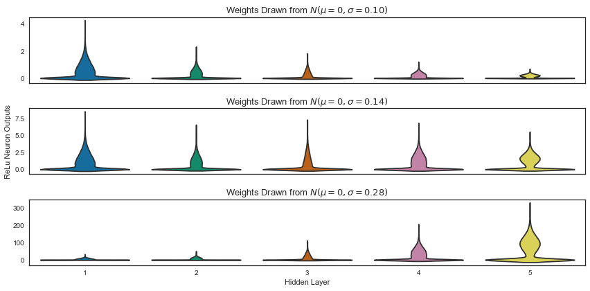

# Understanding Neural Network Weight Initialization

This folder contains scripts for producing the plots used in the [Understanding Neural Network Weight Initialization](https://intoli.com/blog/neural-network-initialization/) article published on the [Intoli blog](https://intoli.com/blog/):

- [plot-activation-layers.py](plot-activation-layers.py) visualizes the distribution of activations over 5 hidden layers of a Multi-Layer Perceptron using three different initializations.
  The script uses ReLu activations, although the article also includes a plot generated by changing  `activation = 'relu'` to `activation = 'linear'` on line 52.
  

- [plot-loss-progression.py](plot-plot-progression.py) visualizes training loss over time as the network is trained using three different initializations.
  

To run the scripts, first grab the files from this folder:

```bash
git clone https://github.com/Intoli/intoli-article-materials.git
cd intoli-article-materials/articles/neural-network-initialization
```

Then, create a virtualenv and install the dependencies:

```bash
virtualenv env
. env/bin/activate
pip install -r requirements.txt
```

You may also need to choose a Matplotlib backend in order to successfully produce plots from a virtualenv.
On macOS, this could be done with

```bash
echo "backend: TkAgg" >> ~/.matplotlib/matplotlibrc
```

while on Linux you might have luck with

```bash
echo "backend: Agg" >> ~/.matplotlib/matplotlibrc
```

Note that the scripts do not save files to disk and simply show the plot in a Matplotlib window.
To make the plots just run the scripts using Python from the virtualenv:

```bash
python plot-activation-layers.py
```

Note that [plot-loss-progression.py](plot-loss-progression.py) takes quite a while to run, since it trains a neural network on 10000 MNIST images three times.
Also, if you use Python 3.6, TensorFlow might issue a runtime warning about having "compiletime version 3.5," but the scripts should still work.
