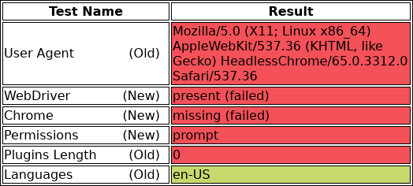
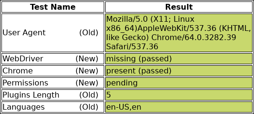

# It is *not* possible to detect and block Chrome headless

[It is *not* possible to detect and block Chrome headless](https://intoli.com/blog/not-possible-to-block-chrome-headless/) is our second installment of techniques to bypass the user-hostile practice of blocking users based on characteristics of their web browsers (see also: [Making Chrome Headless Undetectable](https://intoli.com/blog/making-chrome-headless-undetectable/)).
The test suite is implemented in [chrome-headless-test.html](chrome-headless-test.html) and [chrome-headless-test.js](chrome-headless-test.js).
You can visit the live test page at [https://intoli.com/blog/not-possible-to-block-chrome-headless/chrome-headless-test.html](https://intoli.com/blog/not-possible-to-block-chrome-headless/chrome-headless-test.html) to see how your current browser would fair.
The results should look something like this, where red indicates a headless Chrome indicator.



The test results used in the article are generated using two scripts: [test-headless-initial.js](test-headless-initial.js) and [test-headless-final.js](test-headless-final.js).
These both use [Puppeteer](https://github.com/GoogleChrome/puppeteer) as a browser automation framework to visit the test page and take a screenshot of the results.
The Puppeteer dependency is included in the [package.json](package.json) file and you can install the dependencies by running

```bash
yarn install
```

in this directory.
You can then run the [test-headless-initial.js](test-headless-inital.js) script, which doesn't include any bypasses, with the following command.

```bash
node test-headless-initial.js
```

This will create the [headless-initial-results.png](img/headless-initial-results.png) that you can see above.

To run the tests with the bypasses, you simply need to change the name of the script to [test-headless-final.js](test-headless-final.js).

```bash
node test-headless-final.js
```

This will create a second [headless-final-results.png](img/headless-final-results.png) image which looks like this.



As you can see, all of the tests have been bypassed!
You can peruse the [test-headless-final.js](test-headless-final.js) source code to see how the bypasses are implemented, or visit [the original article](https://intoli.com/blog/not-possible-to-block-chrome-headless/) for a more in-depth explanation of how they work.
